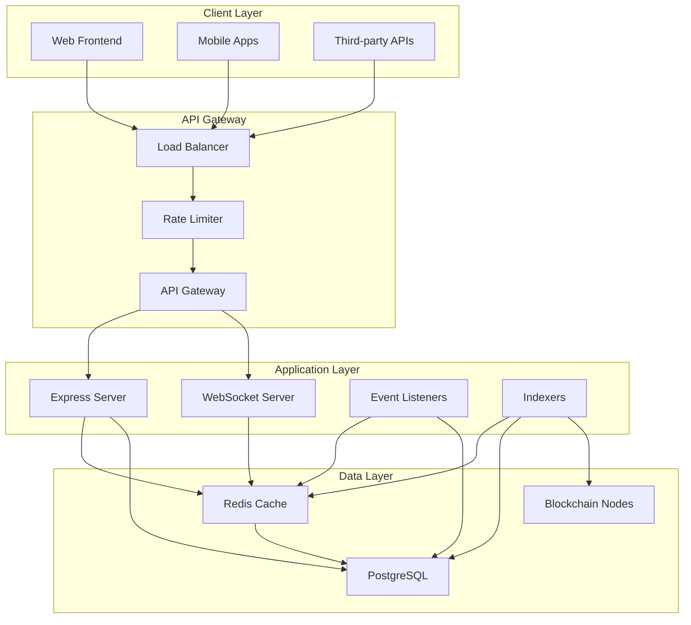
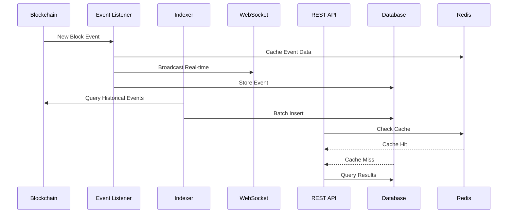

# DeFi Analytics Backend

A comprehensive DeFi analytics backend with blockchain event listeners, PostgreSQL database, REST APIs, WebSocket updates, indexing system, off-chain state management, and scaling optimizations.

## Features

###  Core Architecture
- **TypeScript/Node.js Backend** - Type-safe, scalable backend architecture
- **PostgreSQL Database** - Optimized for DeFi data with proper indexing
- **Redis Caching** - High-performance caching layer for off-chain state
- **Event-Driven Architecture** - Real-time processing and updates

###  Blockchain Integration
- **Multi-Chain Support** - Ethereum, Polygon, Arbitrum
- **Event Listeners** - Real-time monitoring of DeFi protocols
- **Protocol Support** - Uniswap V2, with extensible architecture for additional protocols
- **Smart Contract Integration** - Direct interaction with DeFi smart contracts

###  Analytics & Indexing
- **Historical Data Indexing** - Efficient batch processing of blockchain events
- **Real-time Metrics** - Volume, liquidity, and trading analytics
- **Performance Monitoring** - Track indexer and listener performance
- **Data Aggregation** - Summarized analytics for fast queries

###  API Layer
- **REST API** - Comprehensive analytics endpoints
- **WebSocket Server** - Real-time data streaming
- **Rate Limiting** - Protection against abuse
- **Error Handling** - Comprehensive error management

###  Performance & Scaling
- **Connection Pooling** - Database connection optimization
- **Caching Strategy** - Multi-layer caching with Redis
- **Batch Processing** - Efficient bulk operations
- **Health Monitoring** - System health checks and metrics

## Quick Start

### Prerequisites
- Node.js 18+
- PostgreSQL 13+
- Redis 6+
- npm or yarn

### Installation

```bash
# Clone the repository
git clone <repository-url>
cd DeFiAnalyticsBackend

# Install dependencies
npm install

# Copy environment configuration
cp .env.example .env

# Edit .env with your configuration
# - Database connection details
# - Blockchain RPC URLs
# - Redis configuration
# - API settings

# Run database migrations
npm run migrate

# Start the application
npm run dev
```

### Environment Configuration

Key environment variables:

```env
# Database
DB_HOST=localhost
DB_PORT=5432
DB_NAME=defi_analytics
DB_USER=postgres
DB_PASSWORD=password

# Redis
REDIS_HOST=localhost
REDIS_PORT=6379

# Blockchain RPCs
ETHEREUM_RPC_URL=https://mainnet.infura.io/v3/YOUR_PROJECT_ID
POLYGON_RPC_URL=https://polygon-mainnet.infura.io/v3/YOUR_PROJECT_ID
ARBITRUM_RPC_URL=https://arbitrum-mainnet.infura.io/v3/YOUR_PROJECT_ID

# Server
PORT=3000
WS_PORT=3001
NODE_ENV=development
```

## API Documentation

### Base URL
```
http://localhost:3000/api/analytics
```

### Endpoints

#### Tokens
- `GET /tokens` - List all tokens with pagination
- `GET /tokens/:address/:chainId` - Get specific token details

#### Pools
- `GET /pools` - List all pools with filtering
- `GET /pools/:address/:chainId` - Get pool details with metrics

#### Swaps
- `GET /swaps` - Query swap history with filters
- Supports filtering by: chainId, poolAddress, userAddress, timeRange

#### Metrics
- `GET /metrics/volume` - Volume metrics by time range
- `GET /metrics/liquidity` - Liquidity distribution
- `GET /metrics/top-tokens` - Top trading tokens

### WebSocket Connection

```
ws://localhost:3001
```

#### Subscription Channels
- `swaps` - Real-time swap events
- `pool_updates` - Pool reserve changes
- `liquidity_added` - New liquidity positions
- `liquidity_removed` - Liquidity removals
- `price_updates` - Price changes
- `metrics` - Updated analytics metrics

#### WebSocket Message Format
```json
{
  "type": "subscribe",
  "data": {
    "channels": ["swaps", "pool_updates"]
  }
}
```

## Architecture

### Components

#### Event Listeners
- **BaseEventListener** - Abstract base for all listeners
- **UniswapV2Listener** - Uniswap V2 specific implementation
- **EventListenerManager** - Coordinates multiple chain listeners

#### Indexers
- **BaseIndexer** - Abstract base for historical indexing
- **UniswapV2Indexer** - Uniswap V2 factory indexing
- **IndexerManager** - Manages multiple indexers

#### State Management
- **OffChainStateManager** - Redis + PostgreSQL hybrid storage
- **Cache Management** - TTL-based caching with persistence

#### API Layer
- **AnalyticsController** - REST API endpoints
- **Middleware** - Rate limiting, error handling
- **WebSocketManager** - Real-time communication

### Database Schema

#### Core Tables
- `tokens` - Token information and metadata
- `pools` - Liquidity pool details
- `swaps` - Historical swap transactions
- `blockchain_events` - Raw blockchain events
- `off_chain_state` - Cached computed data
- `indexing_status` - Indexer progress tracking

#### Indexes
- Optimized queries for time-series data
- Composite indexes for multi-column filters
- Partitioning strategy for large datasets

## Performance Features

### Caching Strategy
- **L1 Cache** - Redis for hot data
- **L2 Cache** - Application-level caching
- **Database Persistence** - Backup for cache recovery
- **TTL Management** - Automatic cache expiration

### Database Optimization
- **Connection Pooling** - Reusable database connections
- **Query Optimization** - Efficient SQL with proper indexing
- **Batch Operations** - Bulk inserts and updates
- **Partitioning** - Time-based data partitioning

### Scaling Features
- **Horizontal Scaling** - Multiple indexer instances
- **Load Balancing** - Distribute API requests
- **Graceful Shutdown** - Clean resource cleanup
- **Health Monitoring** - Real-time system health

## Development

### Scripts
```bash
npm run dev      # Start in development mode
npm run build    # Build for production
npm run start    # Start production server
npm run test     # Run tests
npm run lint     # Lint code
npm run migrate   # Run database migrations
```

### Testing
```bash
# Run all tests
npm test

# Run with coverage
npm run test:coverage

# Run specific test file
npm test -- analytics.test.ts
```

## Monitoring

### Health Check
```bash
curl http://localhost:3000/health
```

### System Stats
```bash
curl http://localhost:3000/stats
```

### Metrics Included
- Active WebSocket connections
- Indexer progress and performance
- Event listener status
- Cache hit rates and memory usage
- Database connection health

## Production Deployment

### Environment Setup
1. Configure production environment variables
2. Set up PostgreSQL with proper sizing
3. Configure Redis cluster for high availability
4. Set up reverse proxy (nginx/HAProxy)
5. Configure SSL certificates
6. Set up monitoring and alerting

### Performance Tuning
- Database connection pool sizing
- Redis memory allocation
- Node.js process limits
- Load balancer configuration
- Monitoring and alerting thresholds

## Security

### Features
- Rate limiting on all endpoints
- CORS configuration
- Helmet.js security headers
- Input validation and sanitization
- Error message sanitization in production

### Best Practices
- Environment variable management
- Database connection encryption
- API key rotation
- Regular security updates

## Contributing

1. Fork the repository
2. Create feature branch
3. Make changes with tests
4. Run test suite
5. Submit pull request

## License

MIT License - see LICENSE file for details

## Support

For support and questions:
- Create an issue in the repository
- Check the documentation
- Review existing issues

## Architecture Diagram



## Data Flow



## Technology Stack

### Backend Framework
- **Node.js** - JavaScript runtime
- **TypeScript** - Type-safe development
- **Express.js** - Web framework
- **WebSocket** - Real-time communication

### Database & Caching
- **PostgreSQL** - Primary database
- **Knex.js** - Query builder
- **Redis** - In-memory cache
- **Connection Pooling** - Performance optimization

### Blockchain Integration
- **Ethers.js** - Ethereum library
- **WebSocket RPC** - Real-time blockchain data
- **HTTP RPC** - Fallback blockchain queries

### Development Tools
- **Jest** - Testing framework
- **ESLint** - Code linting
- **Nodemon** - Development auto-restart
- **PM2** - Process management (production)

## Troubleshooting

### Common Issues

#### Database Connection Errors
```bash
# Check PostgreSQL status
sudo systemctl status postgresql

# Test connection
psql -h localhost -U postgres -d defi_analytics

# Check connection limits
SELECT * FROM pg_settings WHERE name = 'max_connections';
```

#### Redis Connection Issues
```bash
# Test Redis connection
redis-cli ping

# Check memory usage
redis-cli info memory

# Monitor Redis
redis-cli monitor
```

#### Event Listener Problems
```bash
# Check RPC endpoint connectivity
curl -X POST -H "Content-Type: application/json" \
  -d '{"jsonrpc":"2.0","method":"eth_blockNumber","params":[],"id":1}' \
  YOUR_RPC_URL

# Monitor WebSocket connections
netstat -an | grep :3001
```

### Performance Optimization

#### Database Indexes
```sql
-- Create composite indexes for better query performance
CREATE INDEX CONCURRENTLY idx_swaps_pool_time 
ON swaps(pool_address, timestamp DESC);

-- Partition large tables by time
CREATE TABLE swaps_2024 PARTITION OF swaps
FOR VALUES FROM ('2024-01-01') TO ('2025-01-01');
```

#### Redis Optimization
```bash
# Configure Redis memory
redis-cli CONFIG SET maxmemory 2gb
redis-cli CONFIG SET maxmemory-policy allkeys-lru

# Monitor performance
redis-cli --latency-history
```

## API Examples

### Fetch Token Analytics
```bash
# Get all tokens with pagination
curl "http://localhost:3000/api/analytics/tokens?page=1&limit=50"

# Get specific token
curl "http://localhost:3000/api/analytics/tokens/0xA0b86a33E644167870492e4b6b8c8d1e8/1"
```

### Query Pool Data
```bash
# Get all pools on Ethereum
curl "http://localhost:3000/api/analytics/pools?chainId=1"

# Get specific pool with details
curl "http://localhost:3000/api/analytics/pools/0x1234...5678/1"
```

### WebSocket Client Example
```javascript
// Connect to WebSocket
const ws = new WebSocket('ws://localhost:3001');

// Subscribe to channels
ws.on('open', () => {
  ws.send(JSON.stringify({
    type: 'subscribe',
    data: {
      channels: ['swaps', 'pool_updates']
    }
  }));
});

// Handle real-time updates
ws.on('message', (data) => {
  const event = JSON.parse(data);
  console.log('Real-time event:', event);
});
```

## Monitoring & Alerting

### Key Metrics to Monitor
- **API Response Time** - < 200ms target
- **WebSocket Latency** - < 100ms target
- **Database Query Time** - < 100ms average
- **Cache Hit Rate** - > 80% target
- **Event Processing Lag** - < 10 seconds target
- **Memory Usage** - < 80% of allocation
- **CPU Usage** - < 70% average

### Alerting Setup
```bash
# Example monitoring script
#!/bin/bash
API_HEALTH=$(curl -s http://localhost:3000/health | jq -r '.status')
if [ "$API_HEALTH" != "healthy" ]; then
  echo "Alert: API unhealthy"
  # Send notification
fi
```

## Roadmap

### Phase 1 - Core Features ✅
- [x] Basic event listening
- [x] REST API implementation
- [x] WebSocket real-time updates
- [x] Database schema design
- [x] Off-chain state management

### Phase 2 - Protocol Expansion
- [ ] Uniswap V3 support
- [ ] SushiSwap integration
- [ ] Curve Finance support
- [ ] Balancer protocol
- [ ] Compound integration

### Phase 3 - Advanced Analytics
- [ ] Price impact calculations
- [ ] Yield farming metrics
- [ ] Liquidation tracking
- [ ] Arbitrage opportunities
- [ ] Portfolio analytics

### Phase 4 - Enterprise Features
- [ ] Multi-tenant support
- [ ] Advanced caching strategies
- [ ] Machine learning predictions
- [ ] Custom dashboard
- [ ] API versioning

## Benchmarking

### Performance Targets
- **API Throughput**: 1000+ requests/second
- **WebSocket Connections**: 10,000+ concurrent
- **Event Processing**: < 5 seconds latency
- **Database Queries**: < 50ms average
- **Cache Operations**: < 1ms average

### Load Testing
```bash
# API load test
artillery run api-load-test.yml

# WebSocket stress test
wscat -c 1000 ws://localhost:3001

# Database benchmark
pgbench -c 10 -j 100 defi_analytics
```

---

Build by Ange
